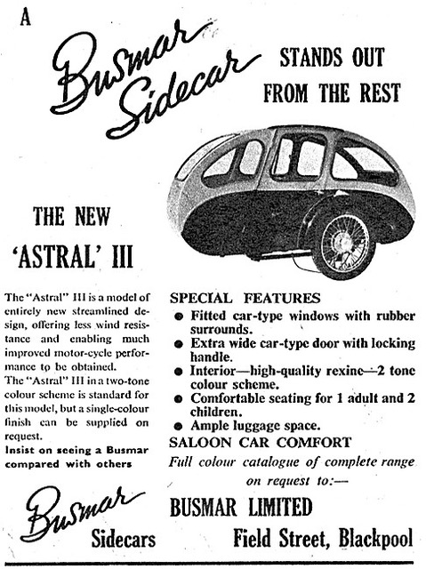

# Classic Bike Owners Club: BSA

| Sykkelens... | |
| - | - |
| Merke | BSA |
| Type | M21 m/Busmar sidevogn |
| Motor | 650 cm³ |
| Årsmodell | 1954 |
| Eier | Jens H. Moos |
 

BSA (Birmingham Small Arms) var et britisk motorsykkelmerke med røtter tilbake til 1903. Selskapet startet opprinnelig med våpenproduksjon, men ble etter hvert verdens største motorsykkelprodusent på 1950‑tallet. BSA er kjent for robuste og driftssikre motorsykler, ikoniske modeller som BSA Bantam, Gold Star og militærsykkelen M20 (Samme som M20, men med 500 cm³ motor), samt en sterk tilknytning til britisk motorhistorie og motorsport

## Historikk

| Periode | Eier / bruk |
| - | - |
| 1954 – 65 | Ordonans-MC i «Midtøsten» |
| 1965 – 67 | Ble overhalt/oppgradert på BSA fabrikken |
| 1967 – 77 | Taxi i London |
| 1977 – 85 | Privat eie i UK |
| 1985 | Importert til Norge |

Dagens eier kjøpte sykkelen i 2001.