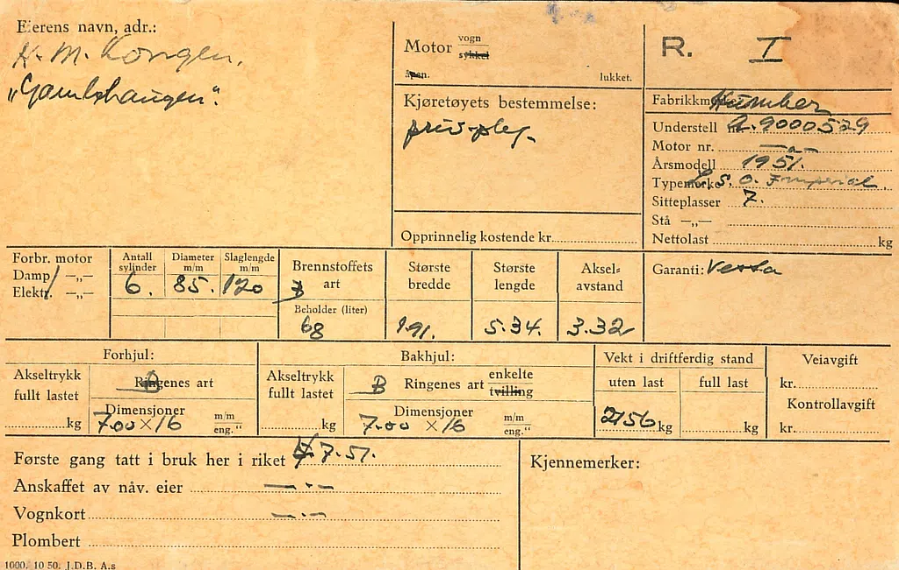

# Kongebilene ved Bergens Tekniske Museum

De to kongebilene er blant juvelene i utstillingen på Bergens Teknisk Museum. De er unike i nasjonal sammenheng, og viser en historisk epoke i Norge, der Kongen hadde biler stasjonert i Bergen for bruk når Kongen var her.

## Humber Pullman (R-1)

Til høyre ser du en Humber Pullman 1951-modell. Den ble gitt som gave til kongefamilien fra Fana kommune i 1951.

  
Foto fra Statsarkivet.

## Lincoln Continental (O-1)

