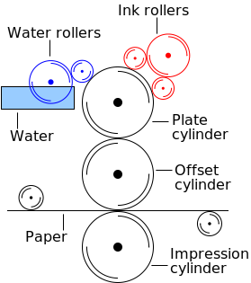

# Offsettrykk: En oversikt over teknologi og prosess

**Offsettrykk** er den mest brukte metoden for produksjon av trykksaker i store opplag, som aviser, blader, bøker og emballasje. Navnet «offset» kommer av at fargen ikke overføres direkte fra trykkplaten til papiret, men via en mellomliggende gummiduk.

## Det grunnleggende prinsippet
Offsettrykk er en **planografisk** (flantrykk) metode basert på det kjemiske prinsippet om at fett og vann avstøter hverandre.

* **Trykkplaten:** Områdene som skal ha farge (tekst/bilder) er fettelskende (oleofile), mens de tomme områdene er vannelskende (hydrofile).
* **Fukting:** Før fargen påføres, fuktes platen med vann. Vannet fester seg kun til de tomme områdene.
* **Farging:** Når den fete trykkfargen påføres, fester den seg kun til de tørre, fettelskende områdene.

## De tre hovedsylindrene
En moderne offsetpresse fungerer ved hjelp av tre roterende sylindere som jobber sammen:

1.  **Platesylinderen:** Her er trykkplaten montert. Den blir fuktet og påført farge.
2.  **Gummivalsen (Offset-sylinder):** Platen ruller mot denne sylinderen, som er dekket av en gummiduk. Bildet overføres (offsettes) speilvendt til gummien.
3.  **Trykksylinderen:** Papiret føres mellom gummivalsen og trykksylinderen. Gummiduken presser fargen over på papiret med jevnt trykk.

## Fordeler og ulemper

| Fordeler | Ulemper |
| :--- | :--- |
| **Høy bildekvalitet:** Gir skarpe og rene bilder. | **Høye oppstartskostnader:** Det koster mye å lage plater og stille inn maskinen. |
| **Lav enhetspris:** Ved store opplag er dette den billigste metoden. | **Tidskrevende oppsett:** Ikke egnet for små opplag (f.eks. under 500-1000 eks). |
| **Allsidighet:** Kan trykke på mange typer overflater (papir, papp, plast, metall). | **Tørketid:** Trykkfargen trenger ofte tid på å tørke før etterbehandling. |
| **Holdbarhet:** Trykkplatene varer lenge (opptil en million trykk). | **Ingen personalisering:** Alle arkene blir identiske (i motsetning til digitaltrykk). |

## 4. Typer offsetpresser

### Arkoffset (Sheet-fed)
Enkeltark mates inn i maskinen. Dette brukes ofte til bøker, brosjyrer og eksklusive trykksaker hvor kvalitet er viktigere enn hastighet.

### Rotasjonsoffset (rotasjonspresse)
Papiret kommer fra store ruller i en sammenhengende bane. Disse maskinene er ekstremt raske og brukes til aviser og ukeblader i store opplag.

([Fra Wikipedia, laget av Yrithinnd](https://en.wikipedia.org/wiki/File:Offset.svg))

## Fargesystemet (CMYK)
For å trykke i fullfarge bruker man fire separate trykkverk i rekke, ett for hver av fargene:
* **C**yan (Blå)
* **M**agenta (Rød/Lilla)
* **Y**ellow (Gul)
* **K**ey (Svart)

Ved å kombinere små punkter (raster) av disse fire fargene, kan man gjenskape nesten alle synlige farger.

