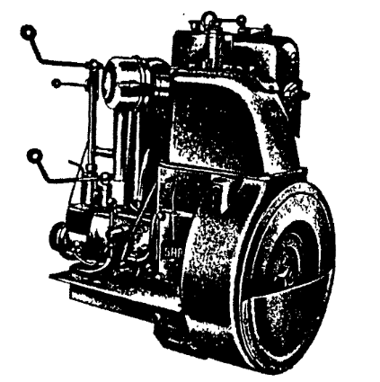

# Sabb - den bergenske motorprodusent

Sabb var en bergensk motorprodusent, grunnlagt i 1925. De holdt til ved Damsgårdssundet, på Laksevåg. De to karakteristiske verkstedshallene er en kjent del av bybildet.

De første motorene var såkale glødemodemotorer eller semidiesler, som var avhengig av en varm overflate for å tenne dieseloljen. Senere gikk også Sabb over til å bygge konvensjonelle dieselmotorer som tenner drivstoffet med kompresjon.

Sabb produserte dieselmotorer frem til 2001, da Sabb gikk over til å kun marinisere motorer fra andre motorprodusenter, og sette merkenavnet Sabb på de.

I dag eies merkenavnet av Frydenbø-konsernet.

## Motoren du ser her

Foran deg ser du en Model GA, som er luftkjølt livbåtmotor. Denne motoren har 10 hestekrefter, og en sylinder. Den veier 220kg.

Disse motorene er svært driftssikre, ettersom de er svært enkle og har få deler, og en solid konstruksjon.

Motoren her har gått som stasjonærmotor på en betongbil, og er ombygd til marinutgave av Jon Grutle, som også eier motoren.
